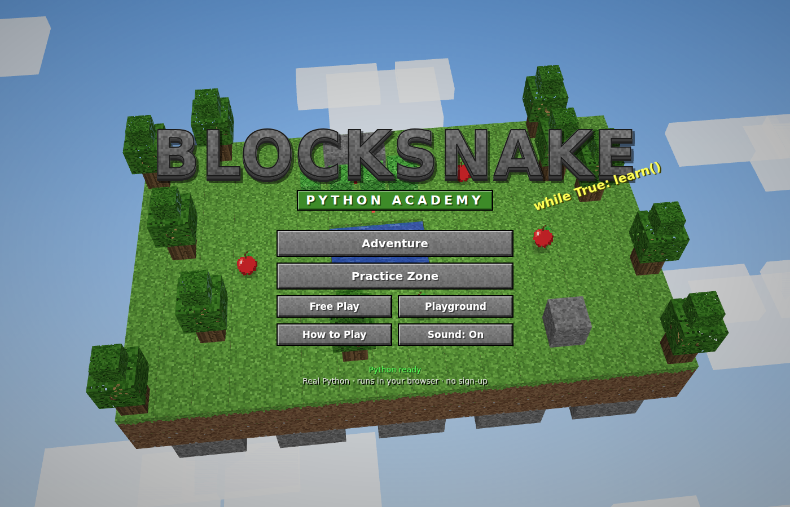
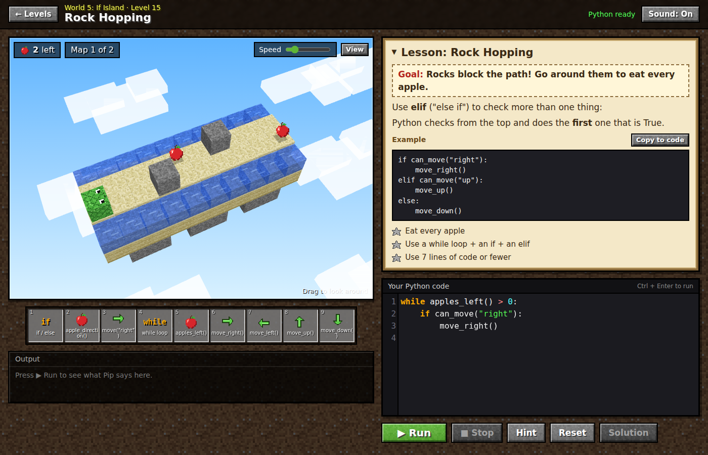

# BlockSnake: Python Academy 🐍🧱

A free website where kids (and anyone!) **learn real Python by playing a blocky 3D snake game**.
Pip the snake only moves when you write and run Python code, like `move_right()`, `for` loops,
`while` loops, `if` / `else`, functions and lists.




## What's inside

- **24 levels in 8 worlds.** Each world teaches one idea:
  1. Grassy Plains: commands
  2. Loop Forest: `for` loops
  3. Variable Desert: variables
  4. While Snowlands: `while` loops
  5. If Island: `if` / `elif` / `else`
  6. Function Woods: `def`, parameters and `return`
  7. List Lake: lists
  8. Lava Mountain: boss levels
- **Lesson book** on every level, with an example you can copy into your code.
- **3 stars per level:** finish it, use the new idea, and keep your code short.
- **Maps that change.** Some levels test your code on 2–3 different maps, so you have to use real loops and ifs instead of counting steps.
- **Practice Zone** with 32 small coding puzzles. They're checked automatically by what your code prints, or by little tests.
- **Free Play** (random apples) and a **Playground** for writing any Python.
- **Friendly error messages**, for example *"Python doesn't know the word 'mve_right'. Did you mean 'move_right'?"*. Missing colons, wrong indentation and never-ending loops are explained in simple words.
- **Hotbar** code blocks: click one to add code to the editor.
- **Blocky 3D world** made with Three.js. All textures (grass, dirt, stone, trees, sand, snow, ice, water, lava, snake, apples) are drawn with code, so there are no image files.
- Progress is saved in your browser. There are no accounts and no server.

## Python commands in the game

| Command | What it does |
|---|---|
| `move_right()` `move_left()` `move_up()` `move_down()` | Move one block. Add a number to move more: `move_right(3)` |
| `move("up")`, `move("up", 2)` | Move in the direction given in quotes |
| `can_move("left")` | `True` if nothing is blocking that way |
| `apples_left()` | How many apples are still on the map |
| `apple_direction()` | `"up"`, `"down"`, `"left"` or `"right"`, toward the nearest apple |
| `say("Hi!")` | Speech bubble over the snake |
| `print(...)` | Write to the Output box |

## Run it on your computer

Download the project and **double-click `index.html`**. It opens in your browser (you need to be online so it can load Python).

Or serve it with any web server:

```bash
python3 -m http.server 8000
# open http://localhost:8000
```

The page loads [Pyodide](https://pyodide.org) (real Python compiled for the browser), Three.js and
CodeMirror from public CDNs. The first **Run** takes a few seconds while Python wakes up.

## Put it online for free (GitHub Pages)

1. Push this repository to GitHub.
2. Go to **Settings → Pages**, choose **Deploy from a branch**, then pick your branch and the `/ (root)` folder.
3. Your site will be at `https://<your-name>.github.io/<repo-name>/`.

## One-folder copy (no CDN for Python)

`node tools/build-single.mjs` builds `dist/`, which contains:
- `blocksnake.html`: the page, with all of its CSS and JavaScript inside
- `pyodide/`: a local copy of Python

Use it for hosts that can't load Python from jsDelivr.

## Tests

```bash
npm install
npm test
```

This opens the site in headless Chromium and checks that:
- every level's reference solution wins with 3 stars on every map
- every level's starting code does *not* already win
- every practice puzzle can be solved
- common mistakes get friendly messages
- a never-ending loop gets stopped
- the page works on a phone-sized screen

Screenshots go to `test-output/`.

## Project layout

```
index.html            all screens
css/style.css         blocky UI theme
js/engine.js          game rules (grid, moves, apples, crashes)
js/python-worker.js   runs player code with Pyodide in a Web Worker
js/runner.js          talks to the worker, restarts it if code gets stuck
js/levels.js          worlds and levels (maps, lessons, hints, solutions)
js/practice.js        Practice Zone puzzles
js/textures.js        16x16 pixel textures drawn with code
js/world3d.js         Three.js 3D world and animations
js/sfx.js             sound effects made with Web Audio
js/app.js             screens, editor, stars, saving
tests/check-levels.mjs  automated checks
```

### Adding a level

Add an object to `LEVELS` in `js/levels.js`. Maps are lists of strings:

| Character | Meaning |
|---|---|
| `.` | floor |
| `S` | snake start |
| `A` | apple |
| `#` | wall |
| `T` | tree |
| `R` | rock |
| `C` | cactus |
| `W` | water |
| `L` | lava |
| space | empty sky |

Give the level a `solution`, then run `npm test` to check that it can be beaten.

---

BlockSnake is a fan-made learning game inspired by blocky sandbox games. It's not affiliated with any game company, and all its art is original.
